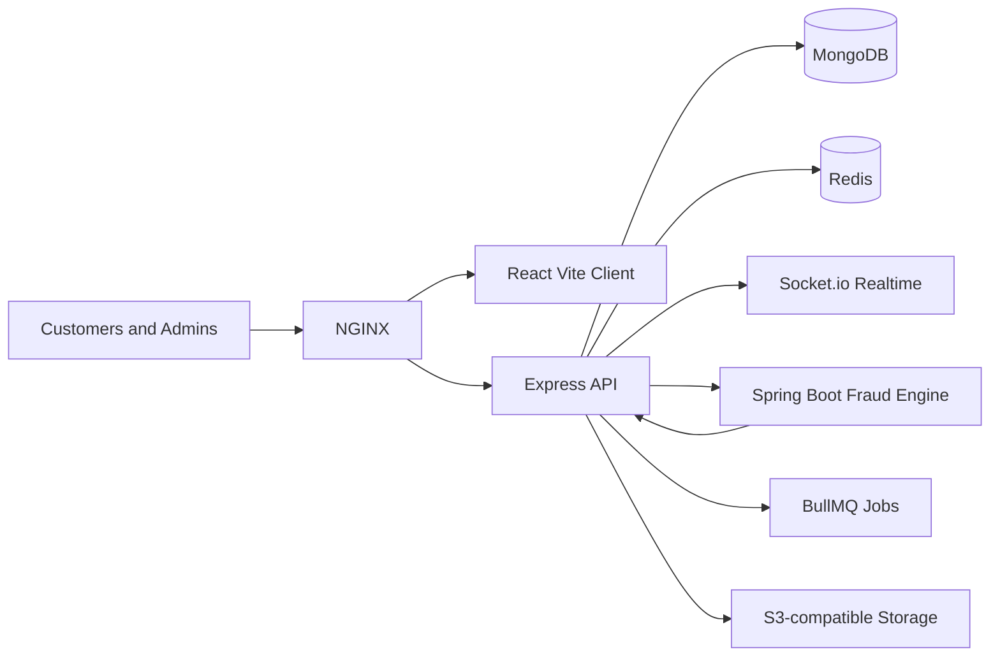

# CouponSphere

CouponSphere is a full-stack dynamic coupon distribution and fraud management platform for SaaS teams, marketplaces, food delivery, gaming, fintech, and marketing operations.

## Architecture



## What Is Included

- React + Vite + Tailwind premium SaaS UI with dashboards, fraud center, analytics, coupon generator, user wallet, theme support, animated cards, charts, and realtime hooks.
- Node.js + Express API with clean controllers, services, repositories, middleware, RBAC, JWT auth, refresh token rotation foundations, rate limiting, validation, audit logging, API docs, and Socket.io.
- MongoDB/Mongoose schemas for users, organizations, coupons, redemptions, fraud logs, campaigns, wallets, notifications, referrals, device fingerprints, analytics events, feature flags, API keys, webhooks, and audit logs.
- Redis-ready cache, rate limiting, BullMQ queue config, and realtime coupon/fraud events.
- Java Spring Boot fraud microservice with Maven lifecycle and REST scoring endpoint.
- Docker Compose with MongoDB, Redis, API, client, fraud service, and NGINX reverse proxy.
- GitHub Actions CI/CD, Jenkinsfile, Kubernetes manifests, deployment docs, seed data, OpenAPI docs, and environment examples.

## Quick Start (Docker)

The fastest way to get CouponSphere running is using Docker Compose:

1. **Configure Environment**:
   ```bash
   cp .env.example .env
   ```
   *Edit the `.env` file to add your MongoDB URI, Redis URL, and JWT secrets.*

2. **Launch Services**:
   ```bash
   docker-compose up -d --build
   ```

3. **Verify Deployment**:
   - **Frontend**: [http://localhost](http://localhost)
   - **API Health**: [http://localhost:5005/api/v1/health](http://localhost:5005/api/v1/health)
   - **API Docs**: [http://localhost:5005/api/v1/docs](http://localhost:5005/api/v1/docs)
   - **Fraud Service**: [http://localhost:8080/actuator/health](http://localhost:8080/actuator/health)

## Local Development

```bash
cd server
npm install
npm run dev
```

```bash
cd client
npm install
npm run dev
```

```bash
cd fraud-microservice
mvn spring-boot:run
```

## Demo Accounts

Seed data creates:

- Super Admin: `super@couponsphere.dev` / `Password123!`
- Business Admin: `admin@urbanbite.dev` / `Password123!`
- Customer: `maya@example.com` / `Password123!`

Run seeds:

```bash
cd server
npm run seed
```

## Security Notes

CouponSphere includes secure HTTP headers, JWT access tokens, refresh-token rotation foundations, bcrypt password hashing, Redis-backed rate limiting, RBAC, audit logging, OTP/2FA fields, CAPTCHA enforcement hooks, device fingerprint models, suspicious activity scoring, and fraud service integration. Social login, SMS/email providers, S3, and CAPTCHA use provider-neutral adapters so production teams can wire preferred vendors.

## Deployment

See [docs/DEPLOYMENT.md](docs/DEPLOYMENT.md), [docker-compose.yml](docker-compose.yml), [nginx/nginx.conf](nginx/nginx.conf), and [k8s](k8s).

